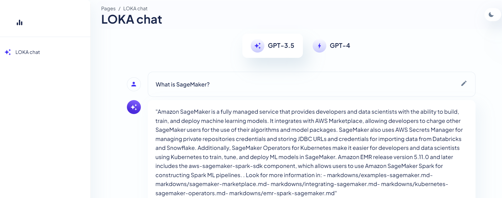
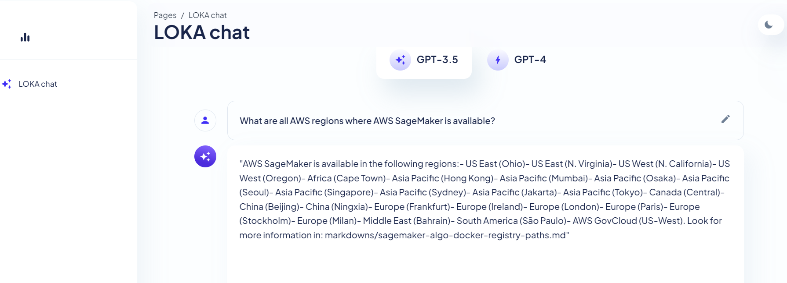
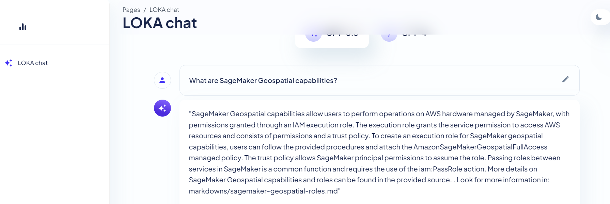
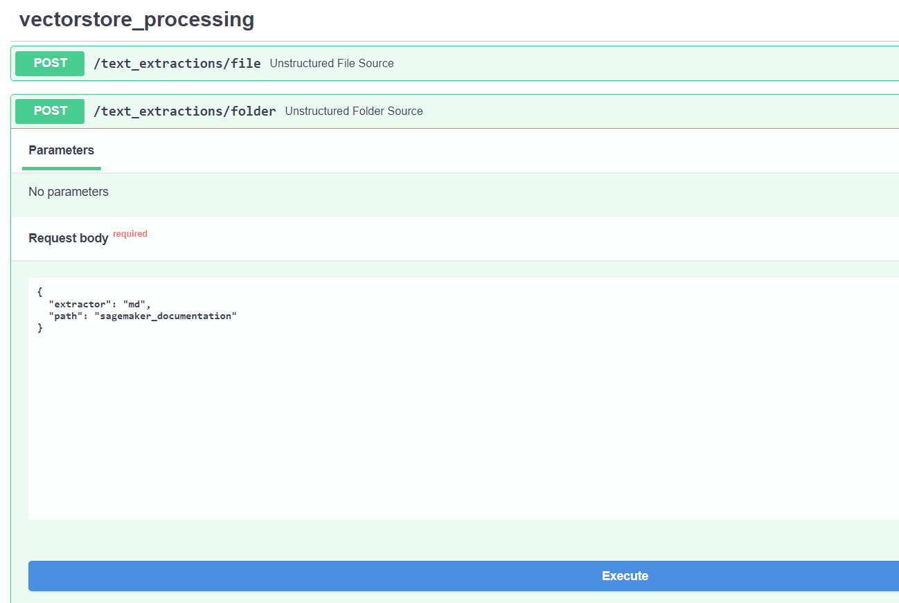

# Amazon Langchain Chatbot 🦜️🔗

Amazon Langchain Chatbot is a chatbot implementation designed for answering questions related to the [LangChain documentation](https://langchain.readthedocs.io/en/latest/) and the OpenAI API. This chatbot is ingested with Amazon SageMaker documentation in Markdown format.

## Functionalities ✅

### 1. Virtual Assistant API
- Provides a Python-based API for virtual assistant question-answering using FastAPI.
- It is currenly answering including sources of information. There is exploration code with conversationalretrieval, multirouterchain, pandas agent. 

### 2. Data Processing and Vectorstore Generation API
- Offers an API for data processing and the generation of vector stores.
- Supports the creation of vector stores from various sources including PDFs, DOCX files, plain text, and Markdown.
- Allows processing of individual files or entire folders.
- Access the API docs by opening [localhost:9003/docs](http://localhost:9003/docs) in your web browser.

## Running the Containers ✅

To run the chatbot, follow these steps:

1. Obtain an API key from OpenAI "OPENAI_API_KEY" and save it in a `credentials.env` file.
2. Run the following Docker Compose command, specifying the environment file: `docker-compose --env-file credentials.env up`
3. Access the chatbot interface by opening [localhost:3000](http://localhost:3000) in your web browser.

## Question Answering examples

1. What is SageMaker?

2. What are all AWS regions where AWS SageMaker is available?

3. How to check if an endpoint is KMS encrypted?

4. What are SageMaker Geospatial capabilities?

## How to update the vectorstore
1. Run the request `/text_extraction/folder`

### Sources of Inspiration

- [ChatGPT AI Frontend Open Source Template](https://github.com/horizon-ui/chatgpt-ai-template)
- [LangChain with Websocket Template](https://github.com/pors/langchain-chat-websockets)
